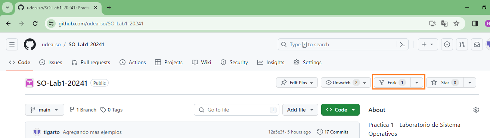

# Práctica 1 de laboratorio - Introducción al lenguaje C

> ## Objetivos
> * Aprender a codificar programas usando el lenguaje C a nivel básico e intermedio.
> * Aprender a usar las herramientas básicas para desarrollar aplicaciones en un ambiente de desarrollo linux.

## Herramientas necesarias

Para trabajar en el laboratorio se necesita tener una máquina con un sistema operativo Linux instalado de manera nativa, mediante máquina virtual o en su defecto una máquina con MacOS. Si usted posee una máquina con Windows y no cumple el requisito anterior, la recomentación es que instale la última versión del [WSL](https://en.wikipedia.org/wiki/Windows_Subsystem_for_Linux). Para llevar a cabo esto último consulte los siguientes enlaces:
1. **Entrenamiento: Introducción a Subsistema de Windows para Linux (WSL)** ([link](https://learn.microsoft.com/es-es/training/modules/wsl-introduction/))
2. **Configurar un entorno de desarrollo de WSL** ([link](https://learn.microsoft.com/es-es/windows/wsl/setup/environment))
3. **Ejecución de aplicaciones de GUI de Linux en el Subsistema de Windows para Linux**([link](https://learn.microsoft.com/es-es/windows/wsl/tutorials/gui-apps)) 

## Primeros pasos

Con el fin de incentivar el trabajo en equipo y el uso de repositorios, antes de comenzar a trabajar en esta práctica, se recomienda que lleve a cabo los siguientes pasos:
* Uno de los integrantes debe realizar un fork de este repositorio.

  

* La persona que haga el fork se debe encargar de agregar como colaborador al compañero de trabajo con el fin de que la modificación del repositorio sea hecha grupalmente.

* Cada uno de los integrantes del equipo puede hacer una copia local del laboratorio con el fin de colaborar en su desarrollo.

No olvide ir actualizando la práctica del laboratorio a medida que vaya avanzando en esta. Para el caso, vaya llevando a cabo los test proporcionados (tal y como se explicó en el laboratorio). Estos test serán el indicativo de cómo va su trabajo. 

Una vez hecho lo anterior puede empezar el desarrollo de la práctica.

### Conceptos importantes

Para llevar a cabo el procedimiento descrito anteriormente es importante que tenga conocimientos básicos de manejo de [github](https://en.wikipedia.org/wiki/GitHub). A continuación, se comparte material de utilidad a cerca del uso de esta herramienta con el fin de que aplique lo que aquí se muestra:
1. **Introducción a Git** ([link](https://learn.microsoft.com/es-es/training/modules/intro-to-git/)): Tutorial de Microsoft Learn sobre el manejo de la utilidad ```git```
2. **Introducción a GitHub** ([link](https://learn.microsoft.com/es-es/training/modules/introduction-to-github/)): Tutorial de Microsoft Learn sobre ```github```
3. **Laboratorio git parte 1** ([link](https://github.com/dannymrock/UdeA-SO-Lab/tree/master/lab0/lab0a/git_basico)): Apuntes de clase viejos sobre el manejo del git.

Además del manejo de la herramienta git, es sumamente importante tener un conocimiento sobre el manejo de la línea de comandos de linux. En los siguientes enlaces puede consultar algunos tutoriales sobre este tema: 
1. **Introducción a Git** ([link](https://learn.microsoft.com/es-es/training/modules/intro-to-git/))
2. **Introducción a GitHub** ([link](https://learn.microsoft.com/es-es/training/modules/introduction-to-github/))

## Recursos lenguaje C

A lo largo de todo el curso (teoría y práctica) se empleará el lenguaje C. Como este es un lenguaje poco usado en el ámbito de la carrera de Ingenieria de Sistemas se abordará de manera introductoria este lenguaje a lo largo del laboratorio con el fin de que usted se familiarice.

Los conceptos básicos relacionados con este lenguaje son bastante similares a lo que se usan en otros lenguajes de programación empleados a lo largo de su carrera (como python y java); sin embargo, hay unos cuantos temas que le resultaran nuevos. Es en estos últimos en los que haremos énfasis. A continuación, se muestran algunos recursos que le serán de utilidad:
1. **Apuntes de clase sobre el lenguaje C** ([link](https://github.com/dannymrock/UdeA-SO-Lab/tree/master/lab0/lab0b)): Apuntes del curso sobre los principales conceptos del lenguaje C que se van a emplear. 
2. **Stanford CS Education Library** ([link](http://cslibrary.stanford.edu/)): Material de Computer Science de la universidad de Stanford.
3. **The GNU C Reference Manual** ([link](https://www.gnu.org/software/gnu-c-manual/gnu-c-manual.html)): Manual de referencia del lenguaje C de la GNU.
4. **C for Java Programmers: Tutorial** ([link](https://www.cs.rochester.edu/u/ferguson/csc/c/tutorial/)): Tutorial de la Universidad de Ronchester sobre el lenguaje C para programadores de Java.
5. **The C programming Languaje** ([link](http://cslabcms.nju.edu.cn/problem_solving/images/c/cc/The_C_Programming_Language_%282nd_Edition_Ritchie_Kernighan%29.pdf)): Libro del lenguaje C de Dennis Ritchie y Brian Kernighan.
6. **C for Python Programmers** ([link](https://realpython.com/c-for-python-programmers/)): Tutorial de Lenguaje C para programadores de Python de [real Python](https://realpython.com/)
7. **C for Python Programmers** ([link](https://www.cs.toronto.edu/~patitsas/cs190/c_for_python.html)): Lenguaje C para programadores de Python de la universidad de Toronto.
7. **Appendix 1: Chapter 1 for Java Programmers - Libro: Dive Into Systems** ([link](https://diveintosystems.org/book/Appendix1/index.html))

A manera de resumen se presentan varias **Reference Sheets** ([link](reference_sheets/)). De estas se resalta la **C Reference Card (ANSI)** ([link](https://www.math.brown.edu/johsilve/ReferenceCards/CRefCard.v2.2.pdf))

## Práctica

> **Nota**: Esta práctica es una traducción de la práctica **Reverse** del libro del profesor Remzi. Esta traducción puede tener algunos errores y no ser fiel con lo que el autor quiere transmitir. Si desea leerla en inglés puede hacerlo en el siguiente ([enlace](https://github.com/remzi-arpacidusseau/ostep-projects/tree/master/initial-reverse)).

### Antes de empezar

Antes de empezar a desarrollar esta práctica, lea el [lab tutorial](http://pages.cs.wisc.edu/~remzi/OSTEP/lab-tutorial.pdf) el cual contiene algunos tips de utilidad para trabajar con en un entorno de programación. 

Adicionalmente, se presenta el siguiente material con algunos ejemplos cuya comprensión le pueden ayudar a familiarizarse con todos los conceptos teorico-practicos necesarios para desarrollar la siguiente practica. A continuación se detalla el material de apoyo.
* **Desarrollo de aplicaciones en lenguaje C usando Linux** ([link](ejemplos/lab_tutorial/))
* **Ejemplos varios del lenguaje C** ([link](ejemplos/conceptos_c/))

### Enunciado

Esta práctica no es más que un simple calentamiento (warm-up) para familiarizarlo con la forma de trabajo en varios de los proyectos que se realizarán en el laboratorio. También sirve de punto de partida para empezar los primeros pasos con el lenguaje de programación C el cual se usará a lo largo del curso.

Se pide que desarrollo un programa sencillo llamado `reverse` el cual se debe invocar siguiendo las instrucciones mostradas a continuación:

```sh
prompt> ./reverse
prompt> ./reverse input.txt
prompt> ./reverse input.txt output.txt
```

En cada una de las instrucciones anteriomente mostradas se puede ver que el usuario ha tecleado el nombre del programa de inversión `reverse` (el `./` delante simplemente se refiere al directorio de trabajo actual directorio, llamado punto, referido como `.` y la barra `/` es un separador; así, en este directorio, se buscó un programa llamado `reverse`). Nótese que cada una de las instrucciones se invocaron de tres formas distintas:
* En el caso la primera instrucción no se ingresó ningún argumento en la linea comandos.
* En lo que respecta a la segunda instrucción se pasó un argumento de línea de comandos (un archivo de entrada, `input.txt`).
* En la última instrucción se pasaron dos argumentos de línea de órdenes (un fichero de entrada y un fichero de salida `salida.txt`).

Por ejemplo, si el archivo de entrada tiene el siguiente contenido:

```
hello
this
is 
a file
```

El objetivo del programa de inversión `reverse` es leer los datos del archivo de entrada especificado e invertirlos; por lo tanto, las líneas se imprimirán en el orden del flujo de entrada. Así, para el ejemplo anterior, la salida debería ser:

```
a file
is
this
hello
```

Las diferentes formas de invocar el archivo (mostradas enteriormente) corresponden a formas ligeramente diferentes de usar esta nueva y sencilla utilidad de Unix. Por ejemplo, cuando se invoca con dos argumentos de línea de comandos, el programa debe leer el archivo de entrada que proporciona el usuario y escribir la versión invertida de dicho archivo en el archivo de salida que proporciona el usuario.

Cuando se invoca con un solo argumento de línea de comando, el usuario proporciona el archivo de entrada, pero el archivo debe imprimirse en la pantalla. En los sistemas basados en Unix, imprimir en la pantalla es lo mismo que escribir en un archivo especial conocido como **salida estándar** o "stdout" para abreviar.

Finalmente, cuando se invoca sin ningún argumento, su programa de inversión debe leer desde la **entrada estándar** (`stdin`), que es la entrada que ingresa un usuario, y escribir en la salida estándar (es decir, la pantalla).

Suena fácil, ¿verdad? Debería serlo. Pero hay algunos detalles...


## Detalles

### Suposiciones y errores

- **La entrada es la misma que la salida:** Si el archivo de entrada y el archivo de salida son el mismo archivo, debe imprimir un mensaje de error "El archivo de entrada y salida deben diferir" y salir con el código de retorno 1.

- **Longitud de la cadena:** No puedes asumir nada sobre la longitud que debe tener una línea. Por lo tanto, es posible que tengas que leer en una línea de entrada muy larga...

- **Longitud del archivo:** No puedes asumir nada sobre la longitud del archivo, es decir, puede ser **MUY** largo.

- **Archivos no válidos:** Si el usuario especifica un archivo de entrada o un archivo de salida, y por alguna razón, cuando intenta abrir dicho archivo (por ejemplo, `input.txt`) y falla, debe imprimir exactamente lo siguiente mensaje de error: `error: cannot open file 'input.txt'` y luego salir con el código de retorno 1 (es decir, llamar a `exit(1);`).

- **Malloc falla:** Si llama a `malloc()` para asignar algo de memoria y malloc falla, debe imprimir el mensaje de error `malloc failed` y salir con el código de retorno 1.

- **Demasiados argumentos pasados al programa:** Si el usuario ejecuta `reverse` con demasiados argumentos, imprima `usage: reverse <input> <output>` y salga con el código de retorno 1.

- **Cómo imprimir mensajes de error:** Ante cualquier error, debe imprimir el error en la pantalla usando `fprintf()` y enviar el mensaje de error a `stderr` (error estándar) y no a `stdout` (salida estándar). Esto se logra en su código C de la siguiente manera: `fprintf(stderr, "whatever the error message is\n");`

### Rutinas de utilidad

Para salir, llame `exit(1)`, el número que se pasa a `exit()` indica al usuario si el programa ha devuelto un error (es decir, devuelve un valor distinto de cero) o ha salido limpiamente (es decir, devuelve 0).

Para leer el archivo de entrada, las siguientes rutinas le harán la vida más fácil: `fopen()`, `getline()`, y `fclose()`.

Para desplegar (en la pantalla, o en una archivo), use la función `fprintf()`.  Tenga en cuenta que es fácil escribir en la salida estándar pasando `stdout` a `fprintf()`; también es fácil escribir en un archivo pasando el `FILE *` devuelto por `fopen`, por ejemplo, `fp=fopen(...); fprintf(fp, ...);`.

La rutina `malloc()` es útil para reserva de memoria. ¿Quizás para añadir elementos a una lista?

Si no sabe como utilizar estas funciones, consulte el manual (`man`). Por ejemplo, escribir en la terminal `man malloc` le mostrará bastante información sobre `malloc`

### Tips

**Start small, and get things working incrementally**  - **Empieze poco a poco y haga que las cosas funcionen gradualmente**: Por ejemplo, primero haga un programa que simplemente lea en el archivo de entrada, una línea a la vez, y luego imprima lo que se lea. Luego, poco a poco vaya añadiendo características y probándolas sobre la marcha.

Por ejemplo, la forma de escribir este código es primero escribir algún fragmento de óodigo que use `fopen()`, `getline()` y `fclose()` para leer el archivo de entrada y luego imprimirlo. Después, escribir el código para almacenar cada línea leída en la lista enlazada y verificar que esto funciona correctamente. A continuación, se imprime la lista en orden inverso. Posteriormente, asegurarse de que los casos de error son manejados y así sucesivamente...

**Testing is critical** - **Las pruebas son fundamentales**: Un gran programador dijo que hay que escribir de cinco a diez líneas de código de prueba por cada línea de código que se produzca; probar el código para asegurarse de que funciona es crucial. Escriba pruebas para ver si el código maneja todos los casos que este debería tratar. Se debe ser lo más exhaustivo posible. Por supuesto, a la hora de calificar los proyectos, esto será una regla. Por lo tanto, es mejor que encuentre los errores primero, antes de que lo hagamos nosotros.

**Keep old versions around** - **Conserve las versiones antiguas**: Mantenga copias de versiones anteriores de su programa, ya que a veces se pueden introducir errores y no ser capaz de corregirlos fácilmente. Una forma sencilla de hacer esto es mantener copias, haciendo explícitamente copias del archivo en varios puntos durante el desarrollo. Por ejemplo, suponiendo que tenga una versión simple de `reverse.c` funcionando (por ejemplo, que sólo lea el archivo); use `cp reverse.c reverse.v1.c` para hacer una copia en el archivo `reverse.v1.c`. Los desarrolladores más sofisticados usan sistemas de control de versiones git (quizás a través de github); vale la pena aprender una herramienta así, ¡así que hágalo!
